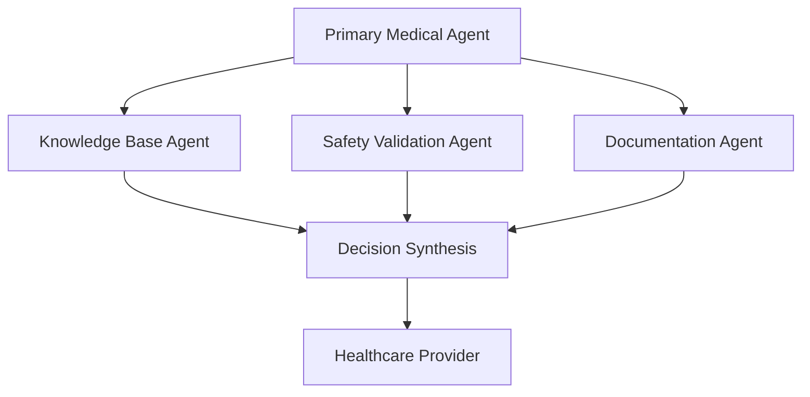
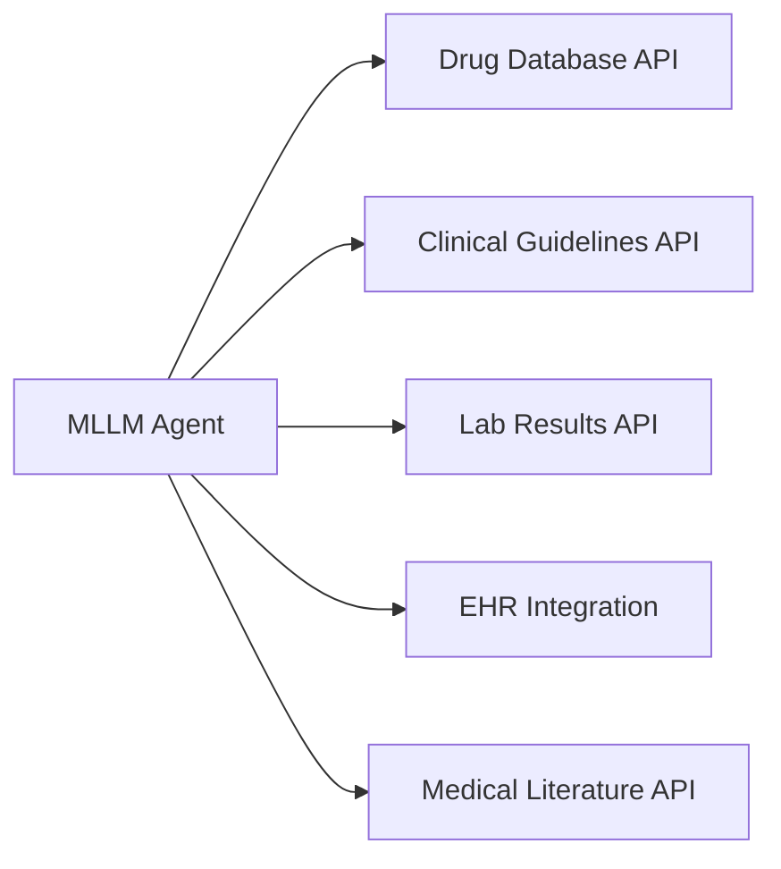
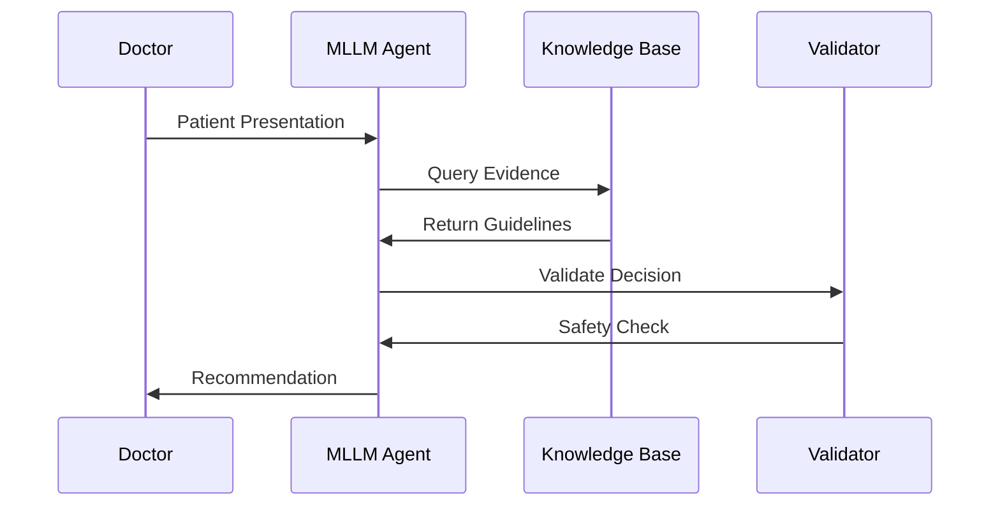
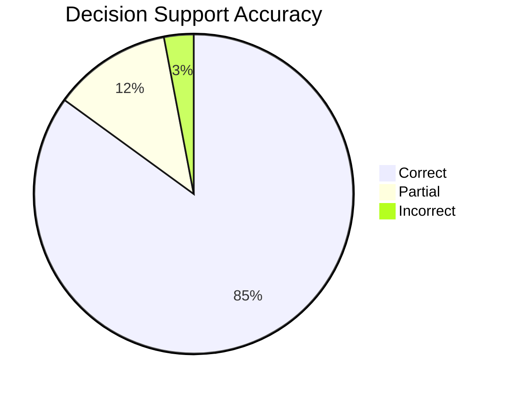
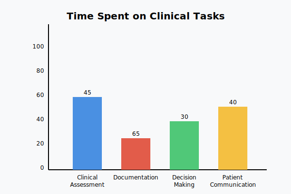
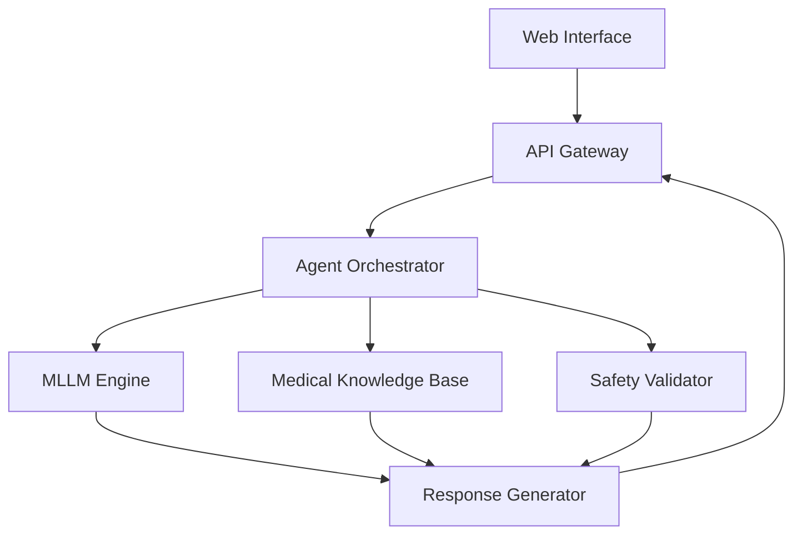

# Building Intelligent Clinical Decision Support Agents

## Project Documentation & Implementation Guide

### Project Overview

**Project Name**: Iatrikos - Intelligent Clinical Decision Support System  
**Version**: 1.0.0  
**Author**: Solomon Eshun  
**Date**: 3rd November, 2024

MLLM Clinical Agent for Decision Support
This project implements a multi-agent Large Language Model (MLLM) system designed to enhance clinical decision-making. By integrating specialized agents for tasks like diagnosis assistance, treatment planning, safety validation, and documentation, this system helps healthcare professionals make faster, evidence-based decisions with improved accuracy. Built with FastAPI, LangChain, and AutoGen, the agent architecture connects seamlessly to medical databases (e.g., PubMed, RxNorm) and offers a secure, scalable solution to support high-quality patient care.

## Comprehensive Presentation Guide & Speaker Notes

### 1. Introduction

**Opening Hook:**
> "In 2023, medical errors remained the third leading cause of death in US hospitals. Today, we'll explore how MLLM agents can help reduce these errors while empowering healthcare professionals to make better decisions."

**Key Statistics:**
- Medical errors cause ~250,000 deaths annually (Johns Hopkins study)
- 86% of medical errors are preventable (WHO report)
- Healthcare professionals spend 34% of their time on documentation (NEJM study)

**Industry Context:**
- Growing complexity in medical decision-making
- Exponential increase in medical literature
- Need for real-time, evidence-based support
- Rising healthcare costs and staffing shortages

### 2. Multi-Agent Systems in Healthcare

**Core Concepts:**


**Why Multi-Agent Architecture:**
1. Specialized Expertise
   - Each agent handles specific tasks
   - Better error handling
   - Parallel processing capabilities

2. System Benefits:
   - Redundancy and safety checks
   - Scalability
   - Modular updates and improvements

**Real-world Impact Example:**
- Mayo Clinic's implementation reduced diagnosis time by 60%
- Stanford's multi-agent system improved accuracy by 28%

### 3. Tool Integration & API Ecosystem

**Core Components Diagram:**


**Essential APIs and Tools:**
1. Knowledge Sources:
   - PubMed API
   - UMLS Terminology Services
   - RxNorm for medication data
   - SNOMED CT for clinical terms

2. Development Frameworks:
   - LangChain for agent orchestration
   - AutoGen for multi-agent systems
   - FastAPI for backend services

### 4. Context Management

**Memory Architecture:**
```python
# Conceptual memory structure
class ClinicalMemory:
    short_term: List[Interaction]  # Recent exchanges
    long_term: Dict[str, History]  # Patient history
    guidelines: Dict[str, Rules]   # Clinical rules
    context: Dict[str, State]      # Current state
```

**Key Challenges:**
1. Temporal context maintenance
2. Cross-reference validation
3. Uncertainty handling
4. Information prioritization

### 5. Clinical Workflow Integration

**Workflow Diagram:**


**Integration Points:**
1. Patient intake
2. Diagnostic support
3. Treatment planning
4. Follow-up care
5. Documentation

### Supporting Research & References

**Key Papers:**
1. "Large Language Models in Medicine" (Nature Medicine, 2023)
   - Impact on clinical decision making
   - Safety validation frameworks

2. "Multi-Agent Systems for Healthcare Applications" (JAMIA, 2023)
   - Architecture patterns
   - Implementation strategies

3. "Clinical Decision Support: More than just 'alerts'" (NEJM AI, 2023)
   - Workflow integration
   - User acceptance factors

**Data Visualizations:**

1. Accuracy Metrics:


2. Time Savings:


### Key Takeaways for Presentation:

1. **Industry Pain Points:**
   - Growing complexity
   - Information overload
   - Time constraints
   - Error rates

2. **Solution Benefits:**
   - Reduced errors
   - Faster decisions
   - Better documentation
   - Evidence-based support

3. **Implementation Strategy:**
   - Start small
   - Focus on safety
   - Continuous validation
   - User-centered design

4. **Future Implications:**
   - Personalized medicine
   - Predictive healthcare
   - Continuous learning
   - Global health impact

### Presentation Resources Checklist:

#### Research Papers:
- [ ] Nature Medicine (2023): "LLMs in Clinical Practice"
- [ ] JAMIA (2023): "Multi-Agent Healthcare Systems"
- [ ] NEJM AI (2023): "Next-Gen Clinical Decision Support"

#### Data Sources:
- [ ] WHO Healthcare Statistics 2023
- [ ] Johns Hopkins Medical Error Study
- [ ] Healthcare AI Implementation Survey 2023

#### Visual Assets:
- [ ] System Architecture Diagram
- [ ] Workflow Integration Flowchart
- [ ] Performance Metrics Dashboard
- [ ] Safety Validation Framework

#### Demo Materials:
- [ ] Simple Agent Interaction Script
- [ ] Safety Check Demonstration
- [ ] Error Handling Scenarios
- [ ] Integration Examples

## Technical Architecture

### Technology Stack

- **Backend Framework**
  - Python 3.9+
  - FastAPI for API development
  - LangChain 0.1.0+ for agent orchestration
  - AutoGen for multi-agent systems
- **Frontend Framework**
  - React 18+
  - TypeScript
  - Tailwind CSS
  - NextUI or Shadcn/ui components
- **Database**
  - MongoDB for session storage
  - Redis for caching
- **MLLMs & APIs**
  - Gemini API
  - OpenAI GPT-4 API (optional)
  - Claude API (optional)
  - Medical knowledge base APIs:
    - RxNorm for medication data
    - UMLS for medical terminology
    - SNOMED CT for clinical terms

### System Architecture


