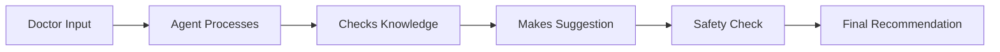

# Understanding MLLM Clinical Agents: Detailed Study Notes

## 1. What Are MLLM Clinical Agents?

### Basic Concept
Think of an MLLM Clinical Agent as a smart medical assistant that can:
- Read and understand patient information
- Look up medical knowledge
- Help make clinical decisions
- Double-check for safety

### Simple Example
Imagine a doctor typing: "Patient has fever, cough, and chest pain for 3 days"
The agent would:
1. Understand these symptoms
2. Check medical databases
3. Suggest possible diagnoses
4. Recommend tests or treatments
5. Warn about any potential risks

## 2. Why Do We Need Them?

### Current Healthcare Challenges
- Doctors are overworked
- Too much medical information to keep up with
- Need to make quick but accurate decisions
- Risk of human error due to fatigue

### How Agents Help
- Save time by quickly checking medical literature
- Reduce errors by double-checking decisions
- Help document patient cases
- Provide consistent recommendations

## 3. How Do They Work?

### Basic Components
1. **Input Processing**
   - Understands doctor's questions and patient info
   - Organizes information in a structured way

2. **Knowledge Access**
   - Connects to medical databases
   - Looks up latest guidelines
   - Checks drug information

3. **Decision Support**
   - Suggests diagnoses
   - Recommends treatments
   - Warns about risks

4. **Safety Checks**
   - Verifies drug interactions
   - Checks for allergies
   - Confirms dosages

## 4. Real Benefits

### For Doctors
- Faster access to medical information
- More time with patients
- Reduced risk of mistakes
- Better documentation

### For Patients
- More consistent care
- Safer treatments
- Better explained decisions
- Fewer medical errors

## 5. Simple Technical Understanding

### Basic Flow

### Key Technologies Used
1. LangChain/AutoGen
   - Helps agents understand medical text
   - Manages conversations
   - Coordinates different tasks

2. Medical APIs
   - Connect to drug databases
   - Access medical guidelines
   - Look up latest research

## 6. Implementation Example

Think of it like building a smart medical assistant that:

1. **Listens**
   - Doctor says: "Check treatment options for diabetes patient with high blood pressure"

2. **Thinks**
   - Understands it's about diabetes + hypertension
   - Knows it needs to check drug interactions
   - Considers patient safety

3. **Responds**
   - Suggests appropriate medications
   - Warns about any risks
   - Provides evidence for recommendations

## 7. Why This Matters

### Impact on Healthcare
- Helps doctors make better decisions
- Reduces medical errors
- Saves time on routine tasks
- Keeps knowledge up-to-date

### Future Potential
- More personalized care
- Better patient outcomes
- Reduced healthcare costs
- Improved medical documentation
