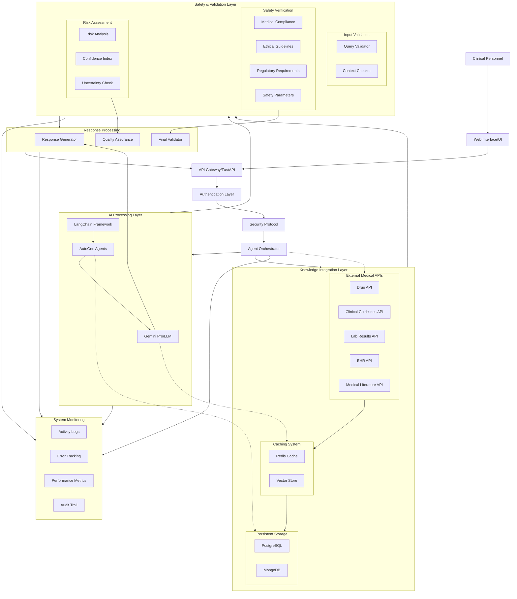
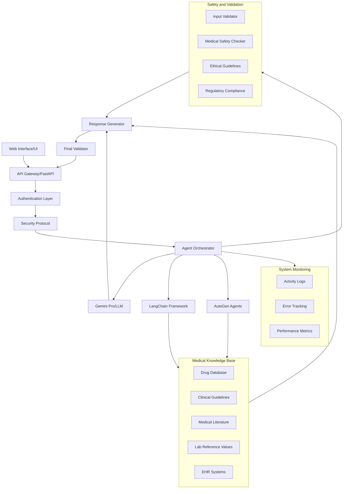
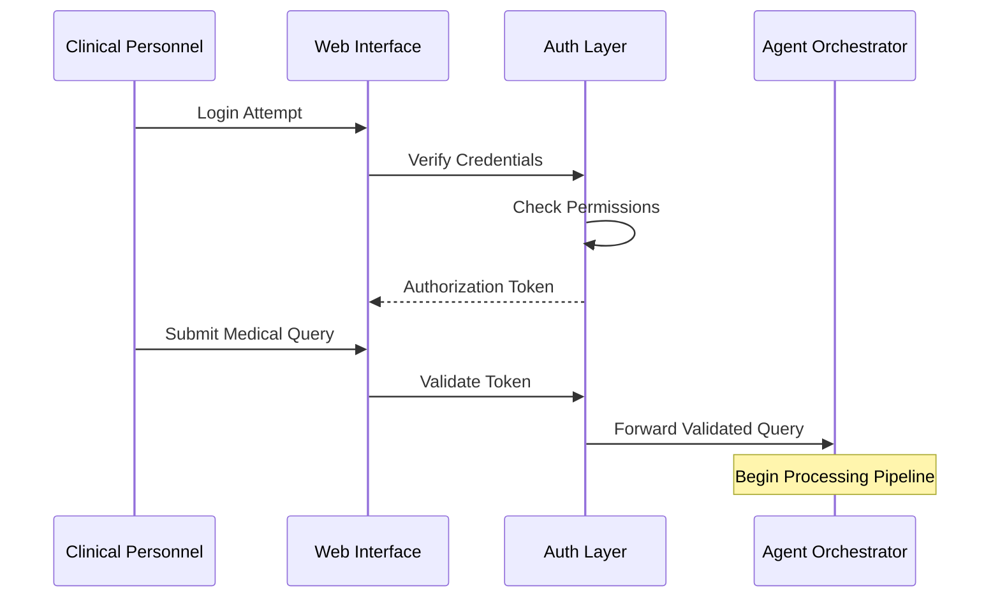
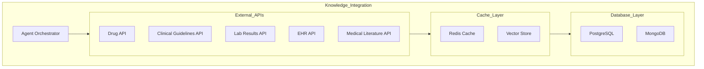
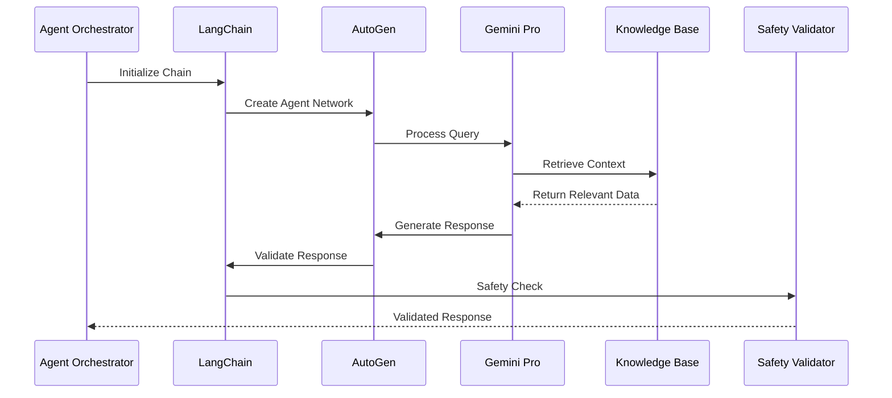
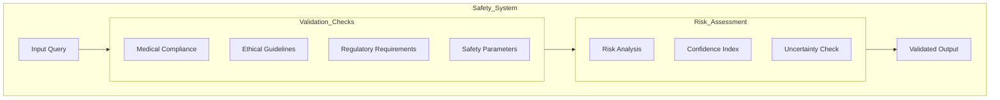
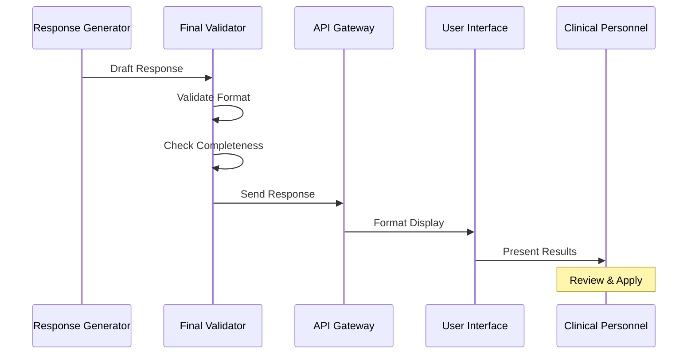

# Iatrikos System Architecture Documentation

## 1. Complete System Architecture

This represents the entire system's high-level overview and interactions.

## Authentication and Clinical Input Flow
Shows how medical professionals interact with the system and how their credentials are verified.

## Knowledge Base Integration
Demonstrates how the system integrates with various medical databases and information sources.

## LLM Processing Pipeline
Details how the system processes queries using LLM and various AI agents.

## Safety and Validation System
Shows the comprehensive safety checks and validation processes.

## Response Generation and Delivery
Illustrates how responses are generated, validated, and delivered to users.

