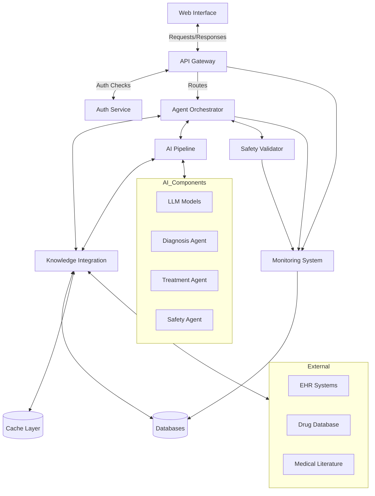
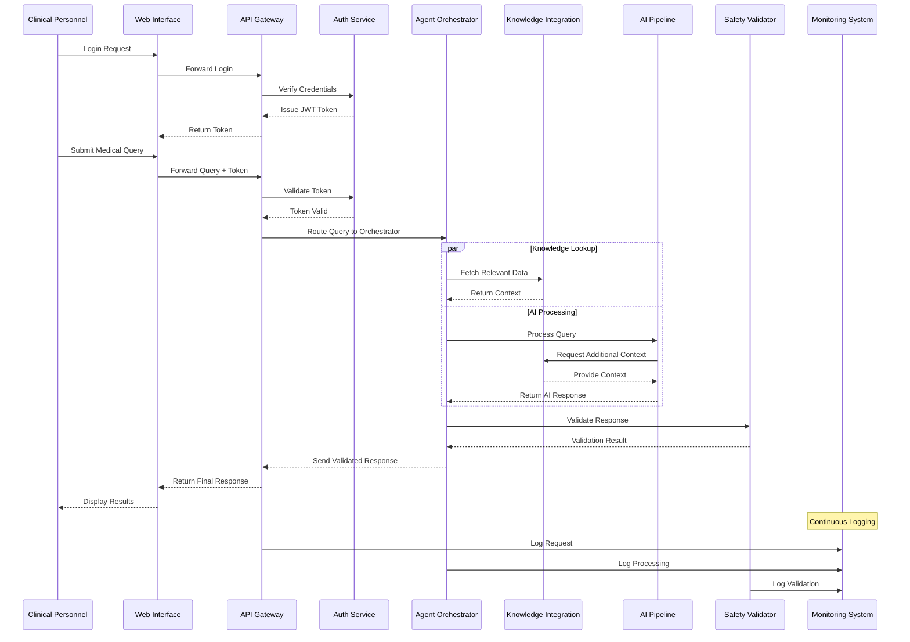
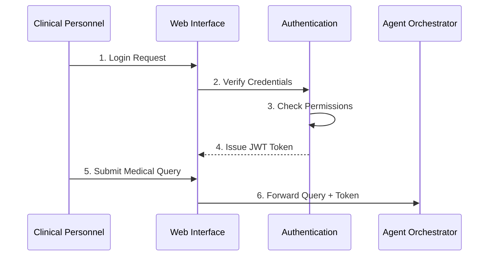
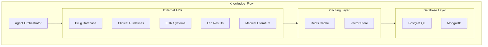
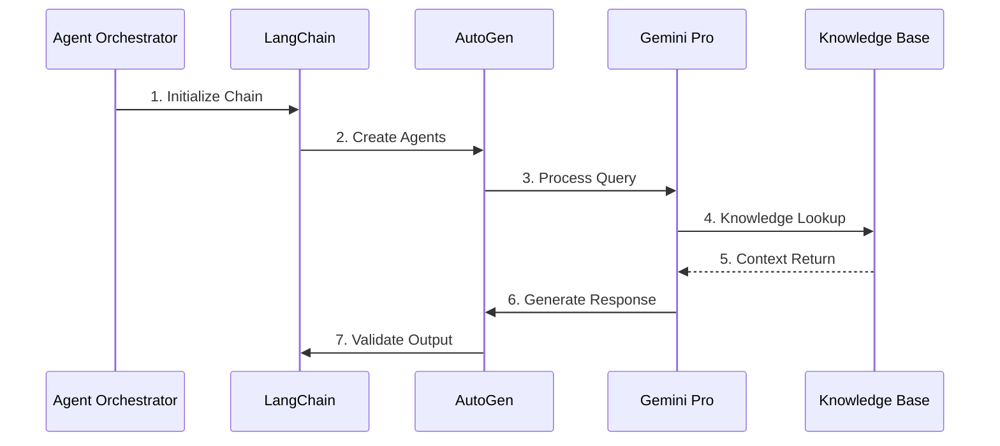
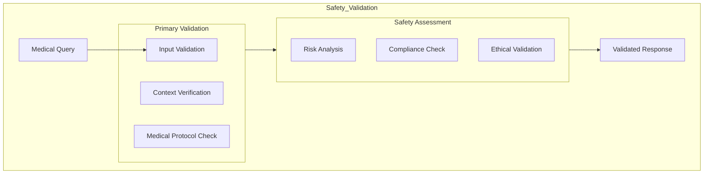
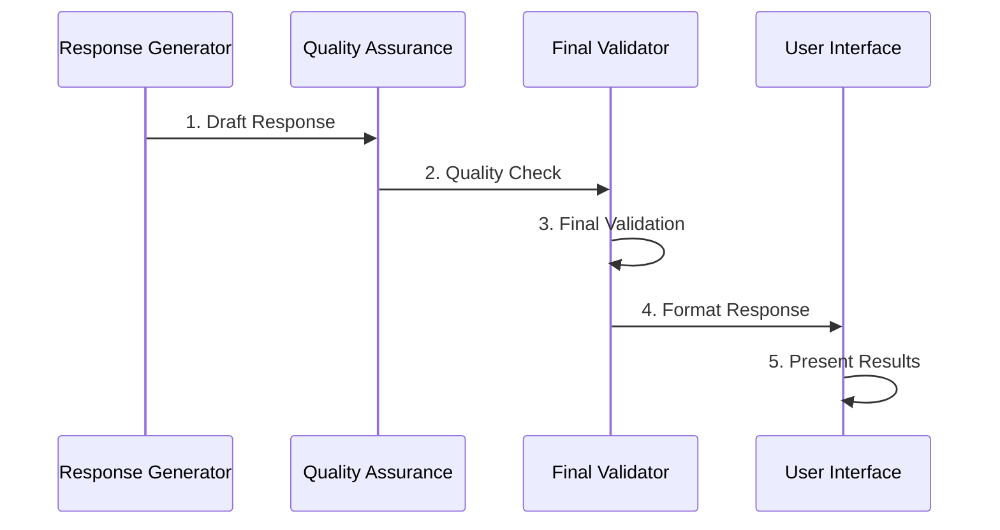
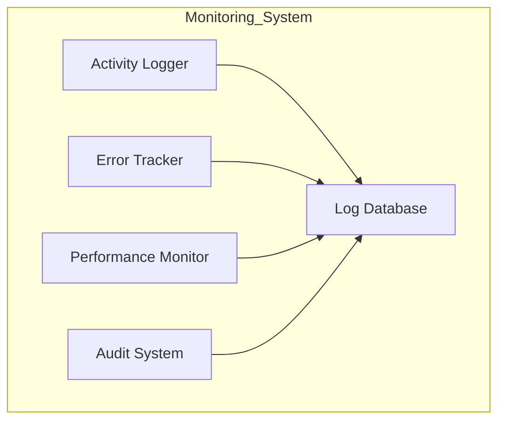

# Iatrikos System - Detailed Component Interactions

## 1. User Interface & Authentication Flow

This component manages how clinical personnel securely access and interact with the system through authentication and data verification processes.

### Detailed Notes:

- **Login Process:** Clinical personnel initiate login through a secure web interface. The interface encrypts the credentials and sends them to the authentication layer for verification.
- **Authentication Process:**
  - The system first validates the user's credentials.
  - It then checks the user's role permissions and verifies access levels.
  - Once validated, a JSON Web Token (JWT) is issued to authenticate future interactions.
  - JWT Token Details: The JWT token contains:
    - User identity for session tracking.
    - Access permissions to control resource visibility.
    - Expiration time to ensure session security.
- **Medical Query Submission:** Clinical personnel submit a medical query tagged with:
  - User Context: Information about the user’s role or department.
  - Specialty Area: Relevant medical specialty of the user.
  - Priority Level: Determines query urgency in case of multiple simultaneous requests.

## 2. Knowledge Integration System

This system connects external data sources, storing commonly accessed information in caches to optimize performance. This system consolidates information from various medical resources to assist in clinical decision-making by providing real-time, data-driven insights.

### Detailed Notes:

- **Agent Orchestrator:** Manages API requests, handles rate limiting, implements retry logic for reliable data retrieval, and coordinates multiple queries.
- **External APIs:**
  - **Drug Database:** Information on medications, interactions, and dosing.
  - **Clinical Guidelines:** Standard protocols and medical best practices.
  - **EHR Systems:** Patient history, current conditions, and treatment records.
  - **Lab Results:** Test interpretations and normal ranges.
  - **Medical Literature:** Access to recent research and case studies.
- **Caching System:**
  - **Redis Cache:** Stores frequently accessed data, session info, and temporary results.
  - **Vector Store:** Stores embeddings for semantic search and similar case lookup.
- **Database Layer:**
  - **PostgreSQL:** Houses structured medical data, user information, and audit logs.
  - **MongoDB:** Manages unstructured medical documents and complex medical records.

## 3. AI Processing Pipeline

The AI processing pipeline uses Large Language Models (LLMs) and a series of agent interactions to process queries and generate medical responses.

### Detailed Notes:

- **Agent Orchestrator:** Manages workflow, handles task distribution, and monitors processing status.
- **LangChain Framework:**
  - Implements prompt templates and manages conversation memory.
  - Coordinates communication between various agents.
- **AutoGen Agents:** Specialized medical agents for specific tasks:
  - **Diagnosis Agent:** Assists in determining possible conditions.
  - **Treatment Agent:** Recommends treatment options.
  - **Drug Interaction Agent:** Checks potential medication conflicts.
  - **Safety Check Agent:** Ensures patient safety by assessing risk factors.
- **Gemini Pro Integration:**
  - Processes natural language, interprets medical context, generates responses, and manages uncertainty in answers.

## 4. Safety and Validation System

The safety and validation system performs multiple checks on responses to ensure adherence to medical protocols and regulatory standards.

### Detailed Notes:

- **Input Validation:** Ensures that the medical query is in the correct format, checks for accurate medical terminology, and verifies context completeness.
- **Primary Safety Checks:** Verifies adherence to medical compliance, assesses risk levels, and validates ethical standards.
- **Risk Analysis:** Involves confidence scoring, uncertainty assessment, and impact evaluation to determine if the response is reliable and safe.

## 5. Response Generation and Delivery

This component processes, validates, and formats the AI-generated response for presentation to clinical personnel.

### Detailed Notes:

- **Response Generation:**
  - Combines LLM output with knowledge base information.
  - Formats medical data for readability and adds references or citations.
- **Quality Assurance:**
  - Checks for response completeness, verifies accuracy, and ensures clarity.
- **Final Validation:**
  - Double-checks safety, verifies format, and customizes response for user specificity.

## 6. Monitoring and Logging

A continuous oversight system logs and monitors user actions, system operations, and response generation to ensure compliance and improve performance.

### Detailed Notes:

- **Activity Logging:** Tracks user actions, system operations, query processing, and response generation for audit purposes.
- **Error Tracking:** Logs exceptions, identifies error patterns, and tracks the resolution status to maintain reliability.
- **Performance Monitoring:** Measures response times, resource usage, and system health to optimize functionality.
- **Audit Trail:** Records critical interactions, such as medical decisions, user activities, and system changes, to verify compliance with medical standards.
